# Neural Network Charity Analysis
## Overview
Using machine learning and neural networks, we create a binary classifier that is capable of predicting whether applicants will be successful if funded by Alphabet Soup.

## Results
### Data Preprocessing
* The target was the variable IS_SUCCESSFUL
* The features for the model where the columns APPLICATION_TYPE (binned), AFFILIATION, CLASSIFICATION (binned), STATUS, SPECIAL_CONSIDERATIONS, USE_CASE, ORGANIZATION INCOME_AMT, ASK_AMT. Except ASK_AMT, all the other features were encoded using Scikit-learn OneHotEncoder
* EIN and NAME were removed from the dataset since they do not add relevant information for the model.
### Compiling, Training, and Evaluating the Model
* Initially, the model consisted of two hidden layers with the rectified linear unit function, the first one with 80 units and the second one with 30 and the output used the sigmoid function. It was trained for 100 epochs and obtained a 72.7% of accuracy. All the 
* I was not able to achieve the target model performance of 75%
* The following steps were taken to improve the performance of the model:
    1. The columns STATUS and SPECIAL_CONSIDERATIONS were dropped.
    2. The ASK_AMT was binned into high and low values.
    3. The model was simplified to only 1 hidden layer.
    4. The hidden layer's activation function was changed to sigmoid.
    5. The number of epochs was increased to 300.

|Model Comparison  |Preprocessing changes                      |Activation Function| Model Summary |Epochs| Accuracy Score | 
|:----------------:|:-----------------------------------------:|:-----------------:|:-------------:|:----:|:--------------:|
|**Initial Model** |Binning APPLICATION_TYPE and CLASSIFICATION|ReLu|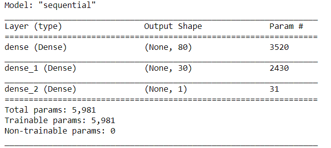|100|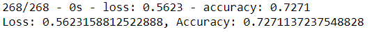|
|**First Attempt** |**Initial Model**                           |Sigmoid|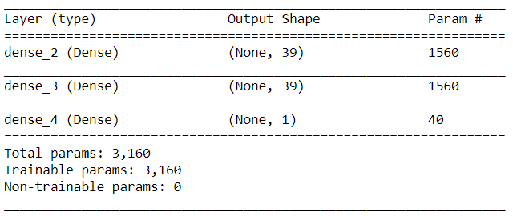|100|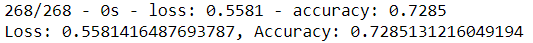|
|**Second Attempt**|**Initial Model** + dropped STATUS          |Sigmoid|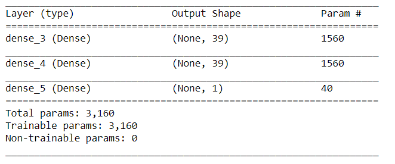|200|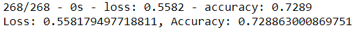|
|**Third Attempt**|**Second Attempt** + dropped SPECIAL_CONSIDERATIONS|Sigmoid|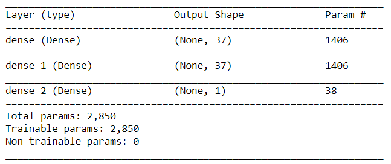|300|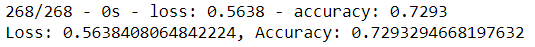|
|**Forth Attempt**|**Third Attempt**                                  |Sigmoid|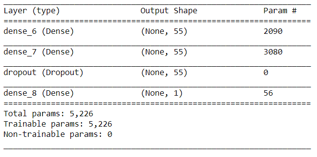|300|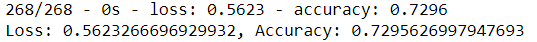|
|**Final Attempt**|**Third Attempt**                                  |Sigmoid|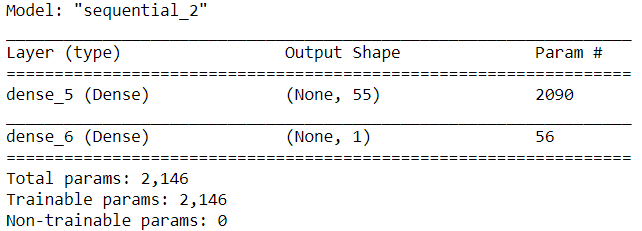|100|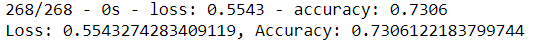|

## Summary
Six models were trained and evaluated without achieving the 75% threshold, the best result was 73.06% with a 1 hidden layer model. Logistic Regressions and XG Boost models with and without PCA did not perform better. This suggests that future efforts should be focused in the preprocessing stage. The main problem is that Neural Networks are notvery successfull with sparse data and using OneHotEncoder does exactly this. Rather than enconding, some numerical relationship should be used instead, for example, we could replace the AFFILIATION column by the IS_SUCCESSFUL means for each category and so with CLASSIFICATION and USE_CASE. Another solution could be to use a model that performs well with sparse data like Factorization Machines.